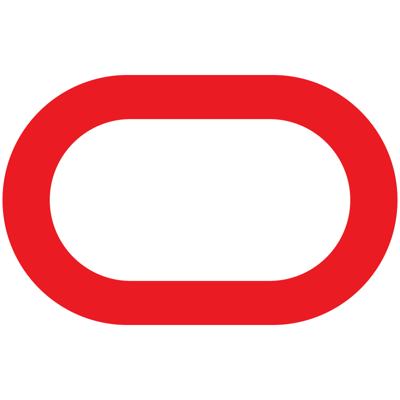

<h1 align="center">Hi 👋, I'm Apoorva Verma</h1>

<h3 align="center">Software Engineer @ Oracle · Applied AI — RAG, LLM Evaluation & ML Systems · Python / TypeScript</h3>

  
  
  
  

  

---
### 🏆 Selective Programs & Fellowships

All highly competitive, national-level selections.

- **JPMorgan Chase** — *Quantitative Research Mentee* — 1 of 35 students across India
- **McKinsey & Company** — *NextGen Women Leaders* — top 50 women in India
-  &nbsp;**Microsoft** — *Engage Mentee* (2022)
- **D. E. Shaw** — DESIS Ascend *Educare Fellow* — **1 of 35** selected from **6,200+** applicants across India

---

### 💼 Professional Impact

-  &nbsp;**Oracle** — *MySQL & HeatWave Release Engineer* — cut integration issues **~30%** across **100+** automated test suites; integrated OpenAI Codex into the release workflow; CI/CD across 5 time zones
-  &nbsp;**Handshake AI** — *Project Dynamo (contract)* — authored frontier-agent evaluation tasks (Terminal-Bench 2 / Harbor)
-  &nbsp;**Oracle** — *Software Engineer Intern* — real-time multimedia + video-annotation tools for Oracle Content Management

---

### 🌐 Open Source & Community

<!-- OSS:START -->
- **53 merged PRs across 27 external projects** — zed, duckdb, posthog, directus, keycloak, weaviate, PapaParse, agents, sqlfluff, falcon, and more
- **30 accepted answers in GitHub Discussions across 22 repos** — typer, turso, helix, dagster, litellm, bevy, dbt-core, clap, textual, nushell, and more
<!-- OSS:END -->

---

### 🚀 Featured Projects

**AI reliability & evaluation** — my core focus: making LLM systems dependable, not just demos.

- **[langchain-shannonbase](https://github.com/apoorva-01/langchain-shannonbase)** — `Python · LangChain · MySQL`
  A LangChain `VectorStore` for MySQL 9's native `VECTOR` type — RAG on ShannonBase, self-hosted MySQL, or HeatWave, no separate vector DB. Fills a real ecosystem gap.
- **[atlasai-mcp-bridge](https://github.com/apoorva-01/atlasai-mcp-bridge)** — `TypeScript · Atlassian Forge`
  An MCP bridge that brings Jira, Confluence & JSM into Claude, Cursor, and any MCP client — OAuth 2.1, Forge SQL, audit logging, React admin UI.
- **[rag-eval-harness](https://github.com/apoorva-01/rag-eval-harness)** — `Python`
  RAG over research papers with a reproducible retrieval-evaluation harness (DeepEval + a custom citation-faithfulness metric).
- **[claude-code-toolkit](https://github.com/apoorva-01/claude-code-toolkit)** — `Shell`
  Skills, subagents, and hooks that make Claude Code follow good engineering practices by default.
- **[dra-industry-4.0-assessment-platform](https://github.com/apoorva-01/dra-industry-4.0-assessment-platform)** — `Next.js · PostgreSQL`
  A digital-readiness platform that scores an organization's Industry 4.0 maturity and surfaces actionable insights.

---

### 📄 Research & Certifications

- **Published ML research** — [*"Crime Detection System using Face Recognition"*](https://www.worldwidejournals.com/indian-journal-of-applied-research-%28IJAR%29/fileview/crime-detection-system-using-face-recognition_September_2022_2664725761_8212604.pdf), Indian Journal of Applied Research (2022) — **88%+** accuracy, sub-4s inference
- **Oracle Cloud Infrastructure 2024 Certified Foundations Associate**

---

### 🛠️ Tech Stack

**Languages**

**AI / ML**

**Backend & Frontend**

**Data & Infra**

---

<i>Building and evaluating AI systems that actually ship — and growing women's representation in STEM along the way.</i>

